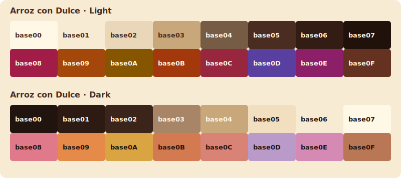

# Arroz con Dulce Tinted Theme

Arroz con Dulce is a pair of warm Base16 colour schemes inspired by the Puerto Rican dessert of the same name. Its cream and rice form the quiet backgrounds; cinnamon, clove, toasted sugar, and raisins supply the earthy browns, amber highlights, and fruit-toned accents.

The light variant recalls arroz con dulce served fresh in a pale bowl, while the dark variant shifts toward cocoa and clove without losing the coconut-cream warmth of the original palette.

## Schemes

- [`arroz-con-dulce.yaml`](base16/arroz-con-dulce.yaml) — warm light variant
- [`arroz-con-dulce-dark.yaml`](base16/arroz-con-dulce-dark.yaml) — cocoa-and-clove dark variant

Both files use the Tinted Theming 0.11 Base16 YAML format.

## Palette

| Base16 slot | Suggested role | Light | Dark |
| --- | --- | --- | --- |
| `base00` | Default background | `#FFF8E7` | `#21140F` |
| `base01` | Lighter/darker background | `#F7EBD3` | `#2C1A13` |
| `base02` | Selection background | `#EAD6B8` | `#3B241A` |
| `base03` | Comments and muted text | `#C8A77A` | `#A98568` |
| `base04` | Secondary foreground | `#765B45` | `#C8A77A` |
| `base05` | Default foreground | `#4A2C20` | `#F2DFC0` |
| `base06` | Emphasized foreground | `#321C14` | `#F8EBD3` |
| `base07` | Strongest foreground | `#21110B` | `#FFF8E7` |
| `base08` | Variables and errors | `#A11D48` | `#E07A8A` |
| `base09` | Numbers and constants | `#A3470A` | `#E68A4A` |
| `base0A` | Classes and warnings | `#855500` | `#D9A441` |
| `base0B` | Strings and additions | `#A2380C` | `#D47A50` |
| `base0C` | Support and regular expressions | `#98263E` | `#D98276` |
| `base0D` | Functions and links | `#5940A0` | `#B99AC8` |
| `base0E` | Keywords | `#8C1F68` | `#D58AB4` |
| `base0F` | Deprecated or embedded content | `#653221` | `#B97755` |

## License

MIT. See [`LICENSE`](LICENSE).
